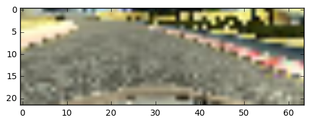
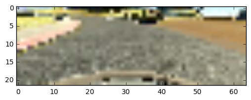
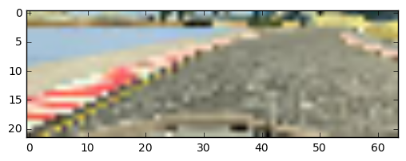

Project 3
=============

Working and Struggle
-------------------------
For this Projects model I tried not to used a prebuilt one *(e.g. nvidia approach)*. Instead I started with a few **convolutional layers**, followed with some **dense layers**. From there I worked my way up with a lot of trial and error. Using different layer sizes, depths, activation functions and optimizers. Furthermore I tried different learning rates, added **AvgPooling** and used **Dropout** to prevent overfitting.

Through the project and with the help of the forum I learned that even more important than choosing a fitting model architecture, one has to do right preprocessing and using good data. I tried some approaches for this (flipping data, gray or colorimages and some more) as well as using the sample data from udacity, making my own data and mixing them up.

Data & Preprocessing
-------------------------
At first I tried to just use my own data, but testing showed that the udacity sample data was a great addition. In the end I decided to use mainly the udacity sample data with added simulation data for the problematic curves *(e.g. the dirtroad curve after the bridge)*. All in all before preprocessing I have 24.000 images *(udacity)* + 8.200 images *(simulation*).

*notes: I used all images (center, left and right) from udacity data and augmented the left and right parts steering angles to get more data with steering angle not near zero. For the simulation images I used only center images. Furthermore I used only approximated 20% of the center-images from udacity data to reduce data with angle zero.*

I resized the pictures to 64x32 pixels, which gives more than enough information and takes far less memory space, so I did not even need python generators or a gpu. Additionally I cutted the top part of the images to get a 64x22 pixel image. I normalized the data with just x_norm = x / 255. Then I added a copy, where flipped the images horizontally and inverted the steering angles to let my model better generalize without prefering left of right curves. Then I shuffled the approximated 52.000 images and steering angles.

Model & Training
-----------------------
I used following architecture to train my model.

**Conv** (8x2x2xsame) - **AvgPool**(2x2) - **Dropout**(0.25) - **BatchNorm** - **ELU** activation - **Conv**(16x2x2xsame) -  **BatchNorm** - **ELU** activation - **Conv** (32x2x2xsame) -  **BatchNorm** - **ELU** activation  - **Conv**(48x2x2xsame) -  **BatchNorm** - **ELU** activation - **Flatten** - **Dense**(256) - **Dropout**(0.40) -  **BatchNorm**  -**ELU** activation - **Dense**(128) -  **BatchNorm** - **ELU** activation - **Dense**(64) - **Dropout**(0.40) -  **BatchNorm** - **ELU** activation - **Dense**(32) -  **BatchNorm** - **ELU** activation - **Dense**(1)

I used **rmsprop** optimizer with learning rate = 0.001 and **mse** for the loss. For the training I choosed a batch sizes of 256 and a validationssplit of 20%, which was working nicely for me. At first I used 15 epochs, but later on changed this to 30 to get a more stable network - this was not hard to decide, because my model seems to be far from overfitting especially with the dropout layers added.

RESUBMIT: Added BatchNormalization before each ELU-Activationlayer.

Saving & Additional Information
---------------
I saved the model in the file *model.json* and the weights in *model.h5*.

For this project I used jupyter notebook, so I added model.ipynb as well as model.py. For more information look the comments in this files up.

The trained model seems to work best on fantastic qualitiy, where I created the additional data *(Runs for at least 30 minutes without breaking out, but probably forever. But I let it run for half an hour.)*

RESUBMIT: Used a generator instead of loading all images in memory. The fantastic quality still works better. I hope
the pictures in this readme are displaying correctly.

Preprocessed Images & Steering Angles
-----------------------

**Steering Angle: -0.25**

**Steering Angle: -0.2166667**

**Steering Angle: -0.2666667**

Thanks in advance for the review.

Greetings Frank
